# 贸站通（TradeHub）外贸独立站 SaaS 平台建设规划书

> **文档性质**：可商用产品的建设蓝图（产品 + 技术 + 交付 + 运维）  
> **当前状态**：仅规划，不写业务代码。确认本文后，再按分期生成 Vue3 后台、Java 后端、Nuxt3 独立站模板。  
> **首个站点样例行业**：机械类 · 加油机 / 燃油加注设备（Fuel Dispenser）  
> **版本**：v1.0  
> **日期**：2026-08-24

---

## 0. 先用 90 秒看懂整件事

你要做的不是「再做一个公司官网」，而是做一个 **可以反复接单的平台**：

1. 你自己有一套 **统一 SaaS 后台**（Vue3）：所有客户的独立站，都在这里建站、改模块、发内容、上下架商品、管多语言、看询盘。
2. 背后有一套 **Java 后端**：租户、权限、商品、内容、SEO、媒体、询盘、发布。
3. 前台是 **可复制的独立站**（Vue3 + Nuxt3）：先做「加油机厂」这一套工业外贸模板，后续换皮肤、换行业即可开新站。

一句话：**后台管一百个站，前台长得像各自的品牌官网，搜索引擎和国外采购都能找到、看懂、留下询盘。**

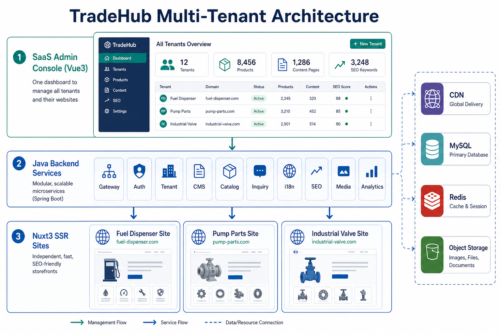

---

## 目录

1. [文档怎么用](#1-文档怎么用)
2. [商业定位与接单模式](#2-商业定位与接单模式)
3. [术语表（专业解释 + 大白话）](#3-术语表专业解释--大白话)
4. [建设原则（可商用必须守住的底线）](#4-建设原则可商用必须守住的底线)
5. [总体架构](#5-总体架构)
6. [多租户模型](#6-多租户模型)
7. [SaaS 后台功能模块（详细）](#7-saas-后台功能模块详细)
8. [Java 后端服务拆分](#8-java-后端服务拆分)
9. [独立站前台与加油机模板](#9-独立站前台与加油机模板)
10. [页面可视化搭建与定制化生成](#10-页面可视化搭建与定制化生成)
11. [多语言与本地化](#11-多语言与本地化)
12. [SEO 全覆盖清单](#12-seo-全覆盖清单)
13. [询盘、转化与客户跟进](#13-询盘转化与客户跟进)
14. [核心数据模型](#14-核心数据模型)
15. [技术栈、仓库结构与接口约定](#15-技术栈仓库结构与接口约定)
16. [权限、安全与合规](#16-权限安全与合规)
17. [上线、部署与运维](#17-上线部署与运维)
18. [客户必须提供的内容与素材清单](#18-客户必须提供的内容与素材清单)
19. [接单交付 SOP（从签约到月度运维）](#19-接单交付-sop从签约到月度运维)
20. [收费、人员与成本建议](#20-收费人员与成本建议)
21. [分期实施路线图](#21-分期实施路线图)
22. [验收标准与风险](#22-验收标准与风险)
23. [确认后如何生成代码](#23-确认后如何生成代码)
24. [附录](#24-附录)

---

## 1. 文档怎么用

这份文档同时给三类人看：

| 角色 | 你重点看哪些章 | 你要带走什么 |
| --- | --- | --- |
| 你自己（产品老板 / 接单人） | 2、3、18、19、20、21 | 卖什么、怎么报价、客户要交什么材料 |
| 开发 / 未来写代码的人 | 5～16、21、23 | 模块边界、数据、技术栈、分期 |
| 运营 / SEO / 交付 | 9、11、12、13、17、18 | 站点信息架构、SEO、内容、上线检查 |

建议阅读顺序：

1. 先读第 3 章术语，后面不会卡住。
2. 再看第 5～7 章，建立「一个后台管很多站」的画面。
3. 再看第 12 章 SEO，这是外贸站能不能接到询盘的生死线。
4. 最后看第 18～21 章，决定你怎么接单、怎么分期做。

---

## 2. 商业定位与接单模式

### 2.1 你到底卖什么

市场上常见三种卖法，本平台 **三种都能接**，但产品形态要按「平台」来建，不能按「单次做包网站」来建。

| 卖法 | 客户买到什么 | 你的成本结构 | 适合谁 |
| --- | --- | --- | --- |
| **建站交付** | 一个品牌独立站 + 后台账号 | 一次性人工高，后续低 | 有明确品牌、要官网的工厂 |
| **平台订阅** | 每月租用 TradeHub，自己运营 | 研发一次性，运维持续 | 你自己做站群，或给代理用 |
| **代运营年框** | 建站 + 内容 + SEO + 询盘跟进 | 人月成本为主 | 工厂不会运营、只看询盘 |

可商用的正确姿势：

- **底层是 SaaS 平台**（一次开发，N 次复用）。
- **表层是行业模板**（加油机、阀门、泵、汽配……一套模板开一个垂直）。
- **交付是标准化 SOP**（第 19 章），避免每个单都从零设计。

### 2.2 为什么必须是「一个后台」

外贸公司、工厂、贸易商经常出现这些情况：

- 一个厂有 2～5 个品牌站（不同品类、不同市场）。
- 同一个产品要发到英文站、西班牙文站、中东站。
- 业务员只关心询盘，不想登录十个 WordPress。
- 你作为服务商，要同时维护几十个客户站，不能每个站一套后台。

所以后台必须是：

**一个登录入口 → 切换租户 / 站点 → 做内容、商品、页面、SEO、询盘。**

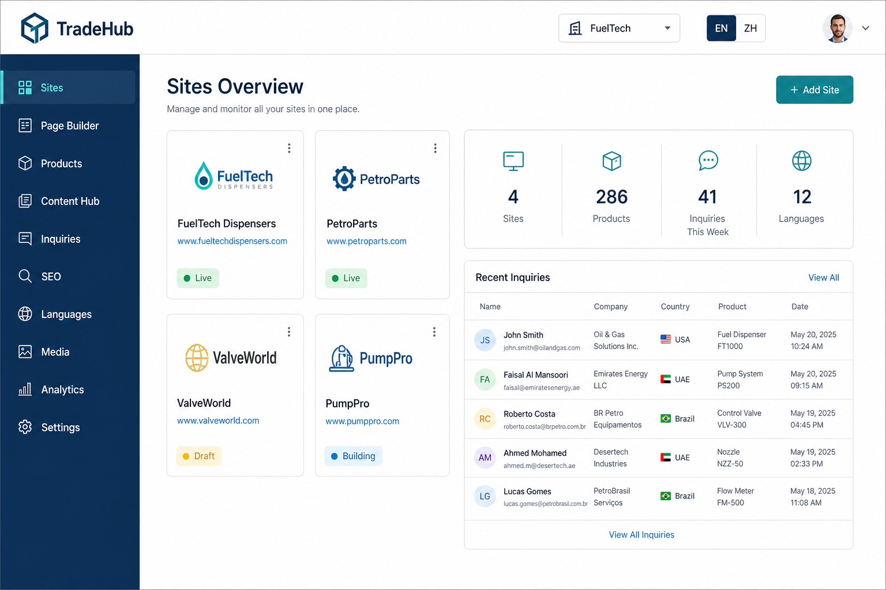

### 2.3 首个可售卖的「标准件」

第一期对外可售卖的最小完整产品（MVP，见术语表）建议定为：

**「工业机械外贸独立站标准版 · 加油机模板」**

包含：

- 多语言官网（至少 EN，可扩 ES / AR / RU / PT）。
- 产品中心 + 规格参数 + 下载资料。
- 询盘表单 + 邮件 / 企业微信 / WhatsApp 通知。
- 全套技术 SEO（SSR、sitemap、hreflang、结构化数据）。
- 后台可视化改首页、产品页、栏目页。
- 你自己的超级管理端，可给下一个客户再开一个站。

加油机只是 **行业皮肤 + 信息架构样板**。后续接阀门、空压机、包装机，是换分类树、参数模板、案例和文案，而不是重做系统。

### 2.4 目标客户画像（便于报价话术）

1. **有工厂、有证书、缺外语官网** 的设备制造商。
2. **有阿里国际站、想要品牌溢价** 的商家（独立站做品牌与 SEO 承接）。
3. **有多个市场域名**（美国站、中东站）需要统一管理的集团。
4. **外贸服务公司 / 代理**，想用你的中台给下游客户批量建站。

---

## 3. 术语表（专业解释 + 大白话）

后面所有模块都会反复出现这些词。每个词都给 **专业定义** 和 **人话**。

### 3.1 站点与商业

**独立站（Independent Website / DTC or B2B Brand Site）**  
- 专业：企业自有域名、自有数据、不依附阿里巴巴/亚马逊等平台的品牌站点。  
- 人话：你自己的官网，客户收藏的是你的域名，询盘进你的邮箱，平台跑了你的站还在。

**外贸独立站**  
- 专业：面向跨境 B2B/B2C 的多语言品牌站，核心转化往往是询盘（Inquiry）而非立即在线支付。  
- 人话：给外国人看的工厂官网，目的是让采购留下联系方式，再跟单出货。

**SaaS（Software as a Service）**  
- 专业：软件以订阅方式通过互联网提供，多租户共用一套代码与基础设施。  
- 人话：不是给每个客户拷一份程序，而是大家登录同一个系统，数据分开。

**多租户（Multi-Tenancy）**  
- 专业：同一套应用实例服务多个客户（租户），通过租户 ID 做数据隔离。  
- 人话：一个后台大楼，每家公司一间办公室，钥匙不同，看不见邻居的合同。

**租户（Tenant）**  
- 专业：SaaS 中的一个客户组织，拥有自己的用户、站点、商品、询盘。  
- 人话：一个签约客户 = 一个租户。一个租户下面可以有多个网站。

**站点（Site / Storefront）**  
- 专业：绑定域名、主题、语言、导航的一个前台实例。  
- 人话：www.fueltech-global.com 这一个对外网站。

**站群**  
- 专业：同一主体或同一中台运营的多个域名站点。需注意搜索引擎对门店网络（Private Blog Network）作弊的惩罚，本平台做的是 **正规多品牌 / 多市场站**，不是黑帽站群。  
- 人话：合法地给不同品牌、不同国家各做一个站，内容要原创或正规翻译，不要复制垃圾页去刷排名。

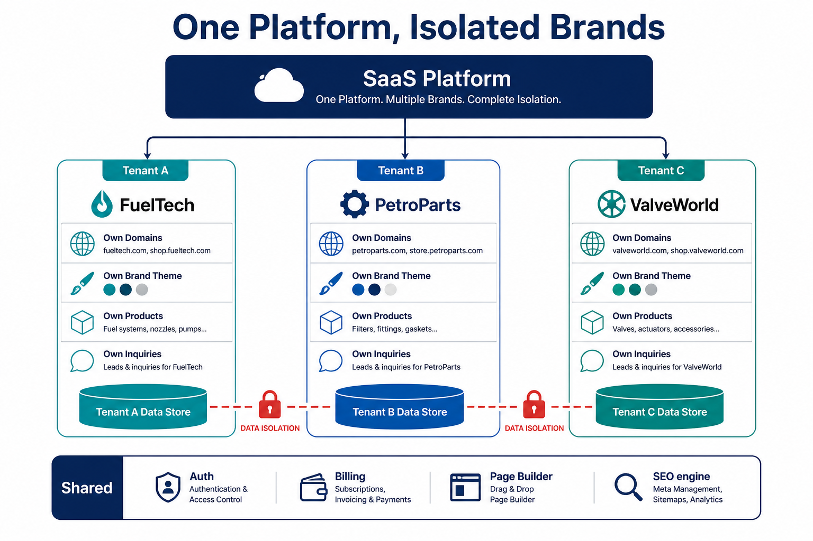

### 3.2 前台与渲染

**SSR（Server-Side Rendering，服务端渲染）**  
- 专业：HTML 在服务器生成后再发给浏览器，爬虫拿到的是完整内容。  
- 人话：谷歌打开你的页面，直接能读到产品名和参数，而不是一片空白等 JavaScript。

**CSR（Client-Side Rendering）**  
- 专业：先下载空壳，再由浏览器 JS 拉数据画页面。  
- 人话：人用着可能流畅，搜索引擎以前经常看不全，外贸站 **不能只靠 CSR**。

**Nuxt 3**  
- 专业：基于 Vue3 的全栈 Web 框架，内置 SSR/SSG、路由、Nitro 服务端。  
- 人话：用 Vue 写官网，但能做成「对 SEO 友好的服务端出 HTML」。

**SSG（Static Site Generation）**  
- 专业：构建时生成静态 HTML。  
- 人话：像印好的宣传册，极快，但商品天天改价时要有增量更新（ISR）。

**ISR / 增量静态再生**  
- 专业：静态页可按过期时间或发布事件重新生成。  
- 人话：既快，又能在后台点「发布」后不久更新线上。

**Hydration（激活）**  
- 专业：把服务端 HTML 与客户端 Vue 实例接上，使页面可交互。  
- 人话：先让谷歌和用户立刻看到字，再让按钮能点。

### 3.3 内容与搭建

**CMS（Content Management System）**  
- 专业：内容管理系统，管理文章、页面、媒体的结构化存储与发布。  
- 人话：后台改字、改图、改栏目，前台跟着变。

**Headless CMS（无头 CMS）**  
- 专业：内容以 API 输出，不绑定某一套前台皮肤。  
- 人话：仓库里只存「内容积木」，加油机站、阀门站都可以来取。

**页面构建器（Page Builder）**  
- 专业：以区块（Block/Section）拖拽组装页面，并持久化为 JSON Schema。  
- 人话：搭积木做首页，而不是每次找程序员改代码。

**Schema（页面/区块模式）**  
- 专业：描述页面由哪些区块、每个区块有哪些字段的结构化定义。  
- 人话：一张「图纸」，告诉系统这里是主视觉、那里是产品栅格。

**主题 Token（Design Token）**  
- 专业：颜色、字体、圆角、间距等设计变量，与具体页面解耦。  
- 人话：换品牌色和 Logo，不用重做一百个页面。

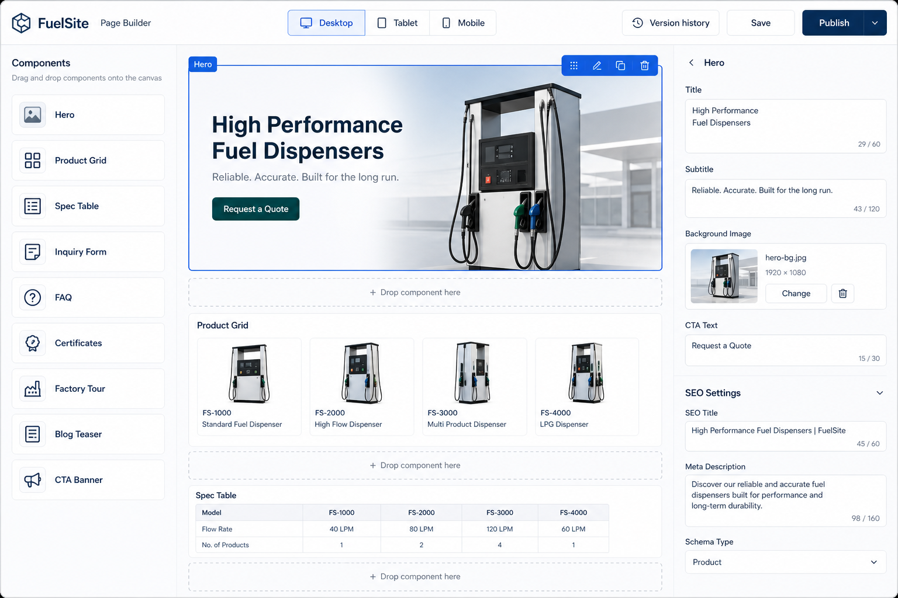

### 3.4 商品与交易（B2B）

**SPU / SKU**  
- 专业：SPU 是标准化产品单元（款），SKU 是库存量单位（具体规格）。  
- 人话：加油机「T80 系列」是 SPU；「T80-四枪-120L/min-220V」是 SKU。

**上下架**  
- 专业：商品在前台可售/可见状态的生命周期管理。  
- 人话：上架 = 官网看得到；下架 = 对外隐藏，后台还在，询盘历史还在。

**询盘（Inquiry / RFQ）**  
- 专业：潜在采购提交的需求请求，B2B 独立站的主转化事件。  
- 人话：外国人填表：「要 20 台加油机，发到迪拜，请报价」。

**MQL / SQL**  
- 专业：营销合格线索 / 销售合格线索。  
- 人话：MQL 是留下联系方式的人；SQL 是业务员确认「这人真能买」的人。

**OEM / ODM**  
- 专业：代工 / 设计生产。机械外贸站几乎必做的能力展示。  
- 人话：客户要贴他们的牌子，或按他们图纸改机器。

### 3.5 国际化

**i18n（Internationalization，国际化）**  
- 专业：产品具备多语言、多区域扩展能力的工程设计。  
- 人话：系统先挖好插槽，以后加阿拉伯语不用推翻重来。

**L10n（Localization，本地化）**  
- 专业：针对某一市场的语言、文化、单位、法规适配。  
- 人话：不只是翻译，中东站可能要 RTL 从右到左，还要把「吨」换成当地习惯。

**Locale（语言区域）**  
- 专业：如 `en`、`en-US`、`pt-BR`、`ar-SA`。  
- 人话：葡语巴西和葡语葡萄牙不是同一套用词。

**hreflang**  
- 专业：告诉搜索引擎各语言版本互为翻译页的 HTML/HTTP 标注。  
- 人话：告诉谷歌：这三页是同一页的英文、西班牙文、阿拉伯文，别当重复内容罚我。

**RTL（Right-to-Left）**  
- 专业：从右到左的书写与布局（阿拉伯语、希伯来语等）。  
- 人话：导航、文章、表单都要镜像，不是把汉字翻成阿语却排版还从左边开始。

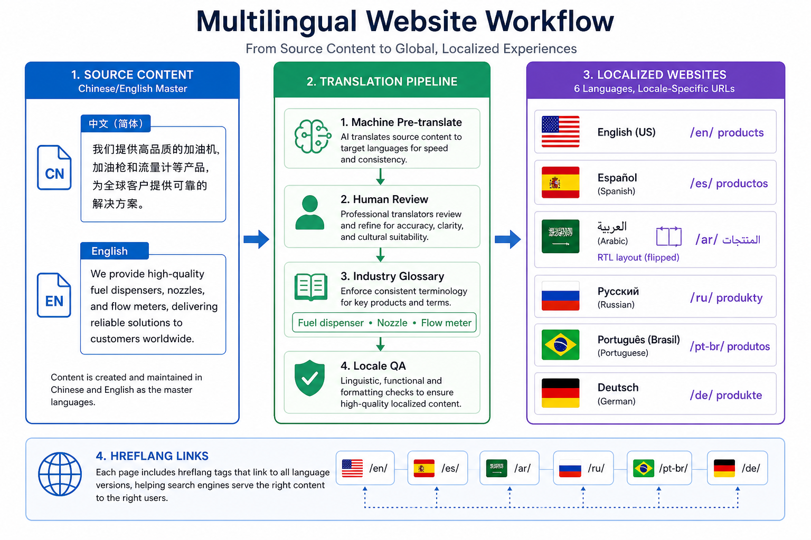

### 3.6 SEO 与流量

**SEO（Search Engine Optimization）**  
- 专业：通过技术、内容、外链与体验，提高搜索可见度。  
- 人话：让外国人在谷歌搜 “fuel dispenser manufacturer China” 时能看到你。

**技术 SEO**  
- 专业：可抓取、可索引、站点结构、性能、移动友好、结构化数据等。  
- 人话：先让谷歌能进门、能看懂，再谈排名。

**On-page SEO（页面内优化）**  
- 专业：标题、H 标签、正文、内链、图片 ALT、URL 的关键词与语义优化。  
- 人话：每个产品页自己把「是什么、给谁、什么参数」写清楚。

**Off-page SEO（站外）**  
- 专业：外链、品牌提及、目录站、Google Business 等。  
- 人话：别人的网站提到你，谷歌才更信你。平台能 **预留位**，执行靠运营。

**Core Web Vitals**  
- 专业：LCP / INP / CLS 等用户体验指标，是排名因素之一。  
- 人话：打开慢、按钮卡、版面乱跳，排名和询盘都会差。

**LCP / INP / CLS**  
- 专业：最大内容绘制、交互到下一次绘制、累计布局偏移。  
- 人话：首屏图出得快不快；点了按钮卡不卡；图片加载时字会不会跳。

**结构化数据 / JSON-LD / Schema.org**  
- 专业：用约定词汇标注组织、产品、FAQ、文章，便于生成富结果。  
- 人话：给谷歌看的「机器可读说明书」，搜索结果里可能出现参数、问答折叠。

**Canonical（规范网址）**  
- 专业：指定一组重复或近似 URL 中的首选版本。  
- 人话：带参数的链接不要和干净产品页抢排名。

**Sitemap（站点地图）**  
- 专业：列出应被索引的 URL 及更新时间的 XML。  
- 人话：给谷歌的目录册。

**robots.txt**  
- 专业：爬虫抓取协议文件。  
- 人话：告诉机器人哪些走廊可以走，哪些是仓库后门不要进（后台、API）。

**IndexNow**  
- 专业：主动向支持该协议的引擎推送 URL 变更。  
- 人话：你一发布产品，主动敲门说「来收新页」。

**E-E-A-T**  
- 专业：经验、专业、权威、可信。  
- 人话：工厂实拍、证书、工程师内容、可验证地址，比空洞形容词值钱。

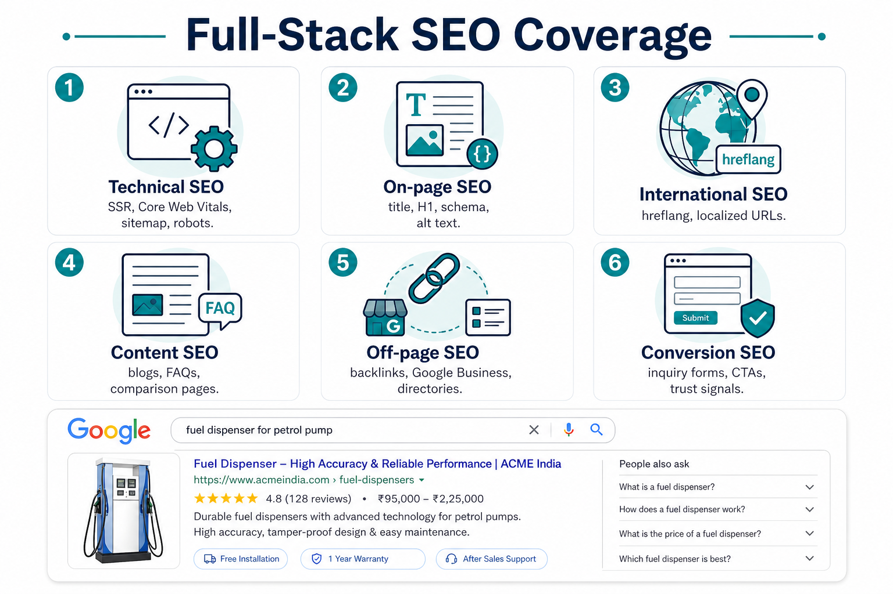

### 3.7 工程与运维

**API（Application Programming Interface）**  
- 专业：系统间约定好的调用入口。  
- 人话：后台、前台、App 都通过同一套「窗口」问后端要数据。

**RESTful / DTO / VO**  
- 专业：资源化 HTTP API；传输对象；视图对象。  
- 人话：前后端交接的快递箱规格要统一，别有的叫 `productName` 有的叫 `name`。

**RBAC（Role-Based Access Control）**  
- 专业：基于角色的权限控制。  
- 人话：老板看全部，编辑只能改内容，业务员只能看询盘。

**JWT**  
- 专业：JSON Web Token，无状态身份凭证。  
- 人话：登录后发一张有期限的通行证。

**CDN（Content Delivery Network）**  
- 专业：把静态资源缓存在全球边缘节点。  
- 人话：美国客户看图片，不用每次都从你国内服务器飘洋过海。

**WAF**  
- 专业：Web 应用防火墙。  
- 人话：挡扫描、挡常见注入和恶意刷询盘。

**SLA**  
- 专业：服务级别协议。  
- 人话：答应客户「全年可用 99.9%」就要真有监控和备份。

**MVP（Minimum Viable Product）**  
- 专业：最小可行产品。  
- 人话：先做出能卖、能上线、能接询盘的一版，而不是一次做完宇宙。

**CI/CD**  
- 专业：持续集成 / 持续交付。  
- 人话：代码一合并，自动测试、自动发布，少靠手工 FTP。

### 3.8 分析与投放

**GA4（Google Analytics 4）**  
- 专业：谷歌分析，事件模型。  
- 人话：看谁来了、看了哪个产品、有没有点询盘。

**GTM（Google Tag Manager）**  
- 专业：标签管理器，不改代码也能加统计和广告像素。  
- 人话：投放同事自己埋点，少找开发。

**GSC（Google Search Console）**  
- 专业：谷歌搜索控制台。  
- 人话：谷歌官方告诉你：哪些词有曝光、哪些页有错误。

**UTM**  
- 专业：给链接打渠道标记的查询参数。  
- 人话：分得清询盘是谷歌广告来的还是邮件来的。

---

## 4. 建设原则（可商用必须守住的底线）

1. **租户隔离是红线**：A 客户永远看不到 B 客户的商品、询盘、媒体。
2. **前台 SEO 不妥协**：独立站必须 SSR（或等价的服务端 HTML），禁止纯 CSR 官网。
3. **内容一次录入、多站分发**：翻译、价格、可见性可以按站点覆盖，而不是复制五份互不相干的数据。
4. **页面可配置，逻辑不写死**：首页、栏目、产品页、落地页都能按区块生成。
5. **B2B 以询盘为主**：第一期不做复杂购物车结算（可预留），先把 RFQ、邮件、WhatsApp 做稳。
6. **行业模板可复制**：加油机模板的信息架构要抽象成「工业设备模板」，不要写死「只有加油机」。
7. **发布有预览、有版本、可回滚**：避免客户自己点发布把线上改崩。
8. **可观测**：慢查询、询盘失败、爬虫 5xx、证书到期，必须能报警。
9. **合规默认开启**：Cookie 同意、隐私政策、表单同意框，尤其是欧盟流量。
10. **不为黑帽站群服务**：不提供隐藏采集、群发门页、自动生成垃圾外链等能力。

---

## 5. 总体架构

### 5.1 逻辑视图

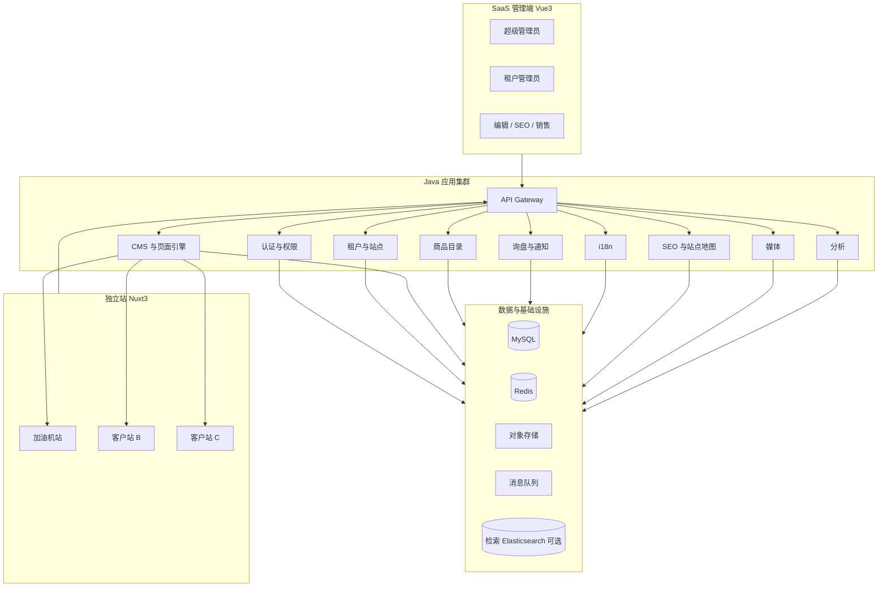

### 5.2 三层职责（和客户讲解用）

| 层 | 技术 | 谁在用 | 干什么 |
| --- | --- | --- | --- |
| 管理端 | Vue3 + TS | 你、客户运营 | 管站、搭页、上架、翻译、看询盘 |
| 中台 | Java 17 + Spring Boot 3 | 无人直接点，全是 API | 规则、数据、权限、发布、通知 |
| 前台 | Nuxt3 SSR | 国外采购、谷歌机器人 | 品牌体验 + 转化 + SEO |

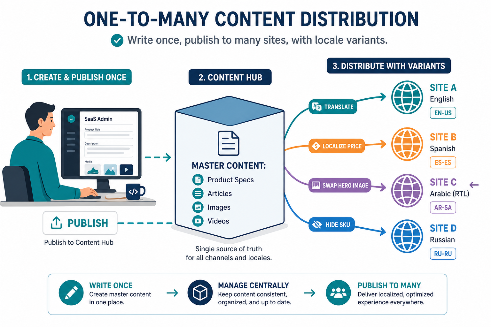

### 5.3 流量怎么走（上线后）

1. 用户或 Googlebot 访问 `www.客户域名.com`。
2. **Cloudflare（或同类 CDN + DNS + WAF）** 做缓存、HTTPS、防攻击。
3. 动态 HTML 由 **Nuxt 服务端** 渲染；图片走 CDN。
4. Nuxt 通过 Storefront API 拉「当前站点 + 当前语言」的页面 Schema、商品、文章。
5. 询盘 POST 到 Inquiry API，写入该租户库，并异步发邮件 / 企业微信。
6. 你在 SaaS 后台看到询盘，客户业务员跟进。

### 5.4 第一期架构选型：模块化单体，而不是一上来微服务

**专业解释**：模块化单体（Modular Monolith）是一个部署单元内按限界上下文拆模块，进程内调用，边界清晰，可在后期拆服务。  
**人话**：先做一栋分区明确的大楼，不要一上来修地铁网。接单阶段要稳、要省运维。

第一期建议：

- **一个 Java 应用**（内部按模块分包：tenant、cms、catalog、inquiry…）。
- **一个 Admin 前端**。
- **一套 Nuxt 站点程序**，用 `SITE_ID` / 域名解析成不同租户主题与数据。
- 当某个模块（例如媒体转码、大批量翻译）成为瓶颈，再拆独立服务。

---

## 6. 多租户模型

### 6.1 三级对象

```
平台 Platform
  └── 租户 Tenant（签约客户，如「某加油机厂」）
        └── 站点 Site（www.a.com、es.a.com 或 www.b-brand.com）
              └── 语言 Locale（en / es / ar …）
```

规则：

- 计费、合同、主账号挂在 **租户**。
- 域名、主题、导航、首页、像素 ID 挂在 **站点**。
- 文案、URL slug、SEO 标题挂在 **站点 × 语言**。
- 商品主数据挂在 **租户**，通过「分发规则」出现在某些站点。

### 6.2 隔离策略

第一期采用 **共享数据库 + `tenant_id` 强制隔离**（Shared DB, Shared Schema）：

- 所有业务表必带 `tenant_id`。
- 后端拦截器从登录态或站点域名解析租户，写入查询条件。
- 禁止前端传 `tenant_id` 作为可伪造参数（只能服务端解析）。
- 对象存储路径：`/{tenantId}/{siteId}/...`。
- 缓存 Key：`t:{tenantId}:s:{siteId}:...`。

后期超大客户可升级为独立 Schema 或独立库，接口不变。

### 6.3 域名与站点绑定

支持三种（可同时存在）：

| 方式 | 示例 | 用途 |
| --- | --- | --- |
| 主域 | `www.fueltech.com` | 品牌主站 |
| 子域 | `es.fueltech.com` | 按市场拆站 |
| 路径语言 | `www.fueltech.com/es/` | 中小客户最省钱 |

超级管理员在后台绑定：域名 → 站点 ID → 默认语言 → SSL。

---

## 7. SaaS 后台功能模块（详细）

后台是你对外演示和日常交付的核心。建议信息架构如下。

### 7.0 全局能力（所有页面都有）

- 租户切换（超管） / 站点切换（租户内多站）。
- 当前语言切换（编辑哪种文案）。
- 预览：草稿 / 待发布 / 线上。
- 操作日志：谁在何时改了价格、SEO、上下架。
- 快捷询盘铃铛（未读数）。

### 7.1 超级管理（只有你用，客户不可见）

| 功能 | 说明 |
| --- | --- |
| 租户开通 / 停用 / 到期 | 套餐、站点数量上限、语言数量上限、存储配额 |
| 套餐与功能开关 | 例如：是否开放博客、是否开放多站点、是否开放 AI 翻译 |
| 模板市场 | 加油机模板、后续阀门模板……给新租户一键安装 |
| 平台公告 | 系统维护通知 |
| 全局监控看板 | 全平台询盘量、错误率、CDN 流量（可第二期） |
| 审计 | 登录失败、越权尝试 |

### 7.2 站点管理

- 创建站点：选择模板（加油机工业模板）。
- 品牌：Logo、Favicon、主色、辅色、字体。
- 域名、跳转（www / 根域）、HTTPS 状态。
- 社交媒体链接、页脚、营业数据（成立年份、出口国、员工数——用于 About 与 Organization 结构化数据）。
- 站点状态：建设中（密码保护或 noindex）、已上线、已停用。

### 7.3 导航与信息架构

- 多级菜单，按语言各一份。
- 页脚链接、侧边 CTA（Get Quote）。
- 自动根据栏目生成面包屑。

加油机模板默认信息架构见第 9 章。

### 7.4 页面与模块设计（Page Builder）

这是「模块设计」需求的落点。

**区块库（工业外贸通用，加油机站默认启用）：**

| 区块 | 用途 |
| --- | --- |
| Hero 主视觉 | 大图 + 标题 + 卖点 + 主按钮 |
| TrustBar 信任条 | CE / ISO / 出口国 / 年限 |
| 产品栅格 | 核心机型 |
| 产品参数表 | 流量、精度、枪数、防爆等级 |
| 解决方案 | 加油站 / 车队 / 船用 / 撬装 |
| 案例与项目 | 国家 + 场景图 |
| 工厂与产能 | 产线、检测、发货 |
| 证书墙 | 可点开大图 |
| FAQ | 同时输出 FAQ 结构化数据 |
| 询盘表单 | 可内嵌任意页 |
| 下载中心入口 | 样本册、CAD |
| 博客列表 | SEO 内容 |
| CTA 条 | 页中转化 |
| 富文本 | 灵活补充 |
| 视频 | YouTube / 自托管，带 VideoObject |
| 自定义 HTML | 受限，防 XSS |

能力：

- 拖拽排序、显隐、复制区块。
- 桌面 / 平板 / 手机预览。
- 每个页面独立 SEO 面板（Title、Description、Canonical、OG、JSON-LD 类型）。
- 另存为「区块组合模板」，给下一个落地页用。
- 版本历史：恢复到 3 小时前。
- 定时发布。

### 7.5 内容中心（Content Hub）

- **文章 / 博客**：分类、标签、作者、封面、正文、FAQ 块、相关产品。
- **栏目页**：解决方案、应用行业。
- **下载资料**：PDF 样本册，可要求留邮后下载（铅粉，第二期可做）。
- **FAQ 库**：可被多个产品页引用。
- **内容分发**：一篇技术文可勾选发布到哪些站点、哪些语言；未翻译语言不输出 URL，避免空页。

### 7.6 商品中心

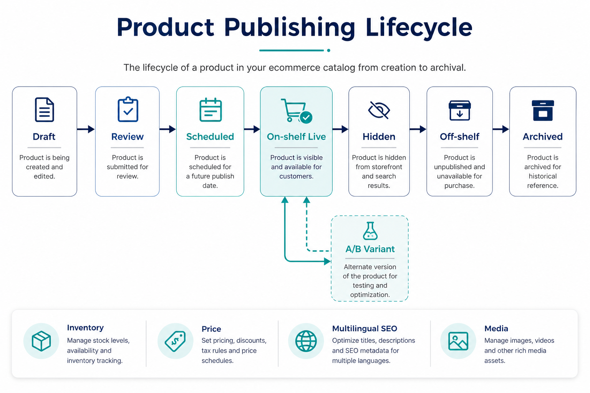

**状态机：**

`草稿 Draft` → `待审 Review`（可选）→ `定时 Scheduled` → `上架 Live` → `隐藏 Hidden`（仍可直链，默认 noindex 可配）→ `下架 Off-shelf` → `归档 Archived`

功能明细：

- 分类树（可按站点显示不同树）。
- 参数模板：加油机默认字段见 9.4，阀门行业以后换模板。
- 多图、360、视频、说明书 PDF。
- 规格 SKU：电压、枪数、流量。
- 相关产品、配件（喷嘴、流量计）。
- SEO：独立 slug、Title、Description、OG 图。
- 分发：哪些站点可见；某站点可覆盖价格显示策略（「询价」或「起订价」）。
- 批量：导入 Excel、批量上架、批量改分类。
- 删除是软删除，询盘关联的商品名快照保留。

### 7.7 询盘与 CRM 轻量版

- 列表：时间、站点、语言、产品、国家（IP 或表单）、来源 UTM。
- 详情：表单字段、浏览页、落地页。
- 状态：新 / 跟进中 / 已报价 / 赢单 / 无效。
- 分配给业务员。
- 导出 Excel。
- 垃圾询盘规则：关键词、同 IP 频率、必填项、蜜罐字段。
- 通知：邮箱、钉钉 / 企微 Webhook、WhatsApp 商务（配置项）。

### 7.8 多语言工作台

- 语言清单与开关。
- 翻译状态看板：缺 Title 的产品数、未译博客数。
- 对照翻译界面：左原文右译文。
- 术语表：fuel dispenser = 加油机，nozzle = 油枪，flow meter = 流量计，防错译。
- 预留 AI 翻译接口（功能开关），**人工确认后才能发布**。
- RTL 预览开关。

### 7.9 SEO 中心

- 全站默认 Title 模板：`{Product} | {Brand}`。
- 站点地图生成与最近提交时间。
- 死链 / 重定向 301 表（改 slug 必须 301）。
- 结构化数据开关与校验结果（抓取公开 URL 检测 JSON-LD）。
- robots.txt 在线编辑（带安全校验，禁止误伤全站）。
- 每页索引状态：index / noindex。
- 与 GSC 的对接说明（第一期手工，第二期 API）。

### 7.10 媒体库

- 上传、文件夹、图片压缩、WebP 派生、宽图多尺寸。
- 强制 ALT（缺 ALT 不可发布到前台，可配置）。
- 水印选配。
- 引用计数：删除前检查是否被产品占用。

### 7.11 表单与转化件

- 自定义表单字段：公司名、采购量、目标港口、电压标准、OEM 需求。
- 不同页面可用不同表单（首页简表 / 产品页详表）。
- Thank You 页（用于广告转化像素）。

### 7.12 分析看板

第一期：

- 询盘数、来源站点、热门产品、热门文章。
- 接入 GA4 嵌入或深度链接。

第二期：

- 站内搜索词、转化漏斗、国家分布。

### 7.13 系统设置

- 成员与角色。
- API Token（给 Nuxt 或未来 ERP）。
- 邮件 SMTP、通知渠道。
- Cookie 横幅文案。
- 维护模式。

---

## 8. Java 后端服务拆分

即使第一期打成一个 Spring Boot，代码模块也必须按下表切开，避免三年后无法维护。

### 8.1 模块一览

| 模块 | 包名建议 | 职责 | 主要接口对象 |
| --- | --- | --- | --- |
| common | `...common` | 统一响应、异常、租户上下文、分页 | `R<T>`、`TenantContext` |
| gateway / web | `...web` | 鉴权过滤器、CORS、限流、访问日志 | JWT、RateLimit |
| iam | `...iam` | 用户、角色、权限、登录、SSO 预留 | User、Role、Menu |
| tenant | `...tenant` | 租户、套餐、配额、站点、域名 | Tenant、Site、Domain |
| i18n | `...i18n` | 语言、翻译条目、术语表 | Locale、I18nEntry、Glossary |
| media | `...media` | 上传、转码任务、CDN 地址 | Asset |
| cms | `...cms` | 页面 Schema、文章、栏目、FAQ | Page、Block、Article |
| catalog | `...catalog` | 分类、SPU/SKU、参数模板、上下架 | Product、Category、Attr |
| publish | `...publish` | 发布单、预览 token、缓存失效 | Release |
| seo | `...seo` | sitemap、robots、redirect、结构化数据组装 | Redirect、SeoMeta |
| inquiry | `...inquiry` | 询盘、反垃圾、通知 | Inquiry、InquiryItem |
| notify | `...notify` | 邮件、Webhook、短信预留 | 异步消息 |
| analytics | `...analytics` | 事件收集（询盘、下载） | Event |
| search | `...search` | 前台搜索（第一期 MySQL，后期 ES） |  |

### 8.2 两条 API 边界

必须从第一天分开，权限模型不同：

1. **Admin API** `/api/admin/**`  
   登录态、RBAC、写操作、可看草稿。
2. **Storefront API** `/api/store/**`  
   按 Host 解析站点，只读已发布数据；询盘 POST 单独限流。

Nuxt 服务端只调 Storefront API，绝不把 Admin Token 打进浏览器。

### 8.3 关键后端机制

**租户上下文**  
网关解析 JWT 或 `Host` → `TenantContext.set(tenantId, siteId, locale)` → Mapper 层自动拼条件。

**发布与缓存**  
保存草稿 ≠ 上线。发布时：

1. 校验缺译、缺 ALT、缺 H1。  
2. 写发布快照（JSON）。  
3. 使 Redis 与 CDN 对应 URL 失效。  
4. 触发 sitemap 增量与 IndexNow（可配）。

**幂等**  
询盘提交用前端 `Idempotency-Key`，防双击变两条线索。

**审计日志**  
商品价格、权限、域名、robots 的变更必须落库。

**导入导出**  
商品 Excel、询盘 Excel，用易读列名，方便给工厂文员。

### 8.4 推荐技术组件（Java）

| 用途 | 选型 | 原因 |
| --- | --- | --- |
| 框架 | Spring Boot 3.3+ / Java 17 | 生态、招人、长期支持 |
| API 文档 | SpringDoc OpenAPI | 前后端对照 |
| ORM | MyBatis-Plus | 国内团队效率高，复杂 SQL 可控 |
| 安全 | Spring Security + JWT | 标准 |
| 缓存 | Redis | 会话、验证码、热点页、限流 |
| 对象存储 | MinIO（开发）/ 阿里云 OSS 或 Cloudflare R2（生产） | 图片与 PDF |
| 任务 | Spring Scheduler + 队列（第一期可 Redis 队列，后期 RabbitMQ） | 邮件、sitemap |
| 校验 | Jakarta Validation | 表单 |
| 地图式搜索 | 第一期 MySQL FULLTEXT 或 LIKE + 分词；量大上 ES | 控制成本 |

---

## 9. 独立站前台与加油机模板

### 9.1 为什么是 Nuxt3 + Vue3

- 与后台同语言，一个人可前后台切换。
- SSR 对 SEO 是刚需。
- 文件系统路由清晰，栏目多也好管。
- Nitro 可部署 Node 或容器，和 Java 分工明确：Java 管业务数据，Nuxt 管体验与 HTML。

### 9.2 加油机站：给采购看的「工厂官网」长什么样

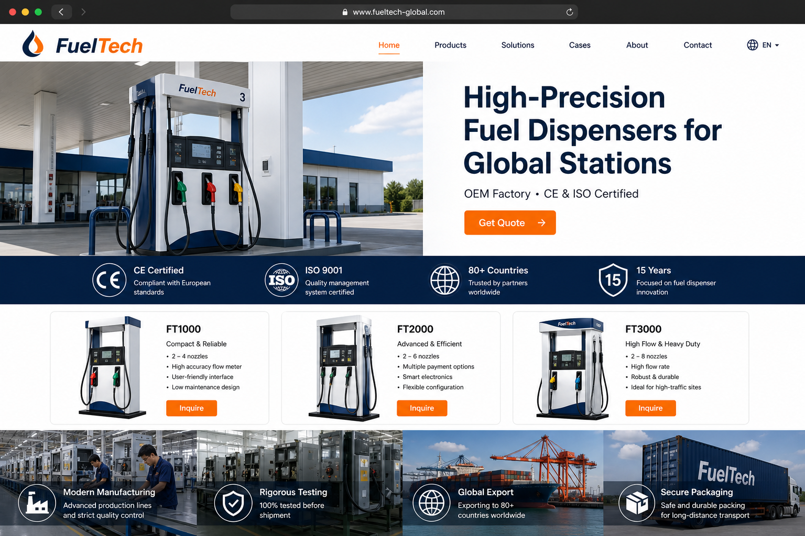

工业 B2B 不要做成花哨电商。采购要在 30 秒内回答：

1. 你们做不做加油机？  
2. 有没有我要的流量 / 枪数 / 防爆？  
3. 有没有证书、出口经验？  
4. 怎么联系真人？

### 9.3 模板页面清单（每一页都要能在后台定制）

| 路由（英文站示例） | 页面 | 定制点 | SEO 要点 |
| --- | --- | --- | --- |
| `/` | 首页 | 全部区块 | Organization + WebSite + SearchAction |
| `/products` | 产品中心 | 筛选、卖点条 | CollectionPage，分页 rel |
| `/products/{category}` | 分类 | 分类长尾文案 | 分类 Title 含商业词 |
| `/products/{category}/{slug}` | 产品详情 | 参数、图库、相关、表单 | Product JSON-LD、FAQ |
| `/solutions` | 解决方案首页 | 场景卡片 | |
| `/solutions/{slug}` | 如 gas-station | 场景正文 + 推荐机型 | 主题聚类 |
| `/projects` 或 `/cases` | 案例列表 | | |
| `/projects/{slug}` | 案例详情 | 国家、工况 | Article 或项目页 |
| `/about` | 关于我们 | 工厂、历史、团队 | Organization 补充 |
| `/factory` | 工厂与实力 | 设备清单 | 信任 |
| `/certificates` | 证书 | 证书文件 | |
| `/downloads` | 下载 | PDF | 部分 noindex 可配 |
| `/blog` | 博客列表 | | ItemList |
| `/blog/{slug}` | 文章 | 内链产品 | Article + FAQ |
| `/faq` | 常见问题 | | FAQPage |
| `/contact` | 联系 | 地图、多表单 | LocalBusiness 可选 |
| `/inquiry` | 询盘 | 多产品勾选 | Thank you 另路由 |
| `/search` | 搜索结果 | | noindex |
| `/privacy` `/cookies` `/terms` | 法律页 | | |
| 自定义落地页 `/lp/{slug}` | 广告落地 | 任意积木 | 按需 index |

另需系统页：404、410（下架产品可 301 到分类或 410）、维护页、Cookie 偏好。

### 9.4 加油机默认产品参数模板（可在后台改）

这些字段既是详情页表格，也是筛选项，也是结构化数据 `additionalProperty`。

| 字段 key | 英文显示名 | 说明 |
| --- | --- | --- |
| flow_rate | Flow Rate | 如 50/80/120 L/min |
| accuracy | Accuracy | 如 ±0.2% |
| hose_count | Hoses / Nozzles | 枪数 |
| product_types | Fuel Types | Gasoline / Diesel / AdBlue |
| explosion_proof | Explosion-proof | Ex 标志 |
| voltage | Voltage | 110V / 220V / 380V |
| display | Display | LCD / LED |
| mounting | Mounting | Island / Skid / Mobile |
| communication | Protocol | 后台管理系统对接 |
| certification | Certifications | CE, ATEX, ISO |
| ambient | Ambient Temp | 高寒 / 高温市场 |
| oem | OEM/ODM | Yes/No |

分类建议：

- Fuel Dispensers（加油机整机）
- Mobile / Skid Units（撬装、移动加注）
- Nozzles & Accessories（油枪配件）
- Flow Meters & Pumps（流量计与泵）
- Spare Parts（备件）

### 9.5 前台技术要点

- `@nuxtjs/i18n`：前缀策略与 hreflang 自动输出。
- 图片：`NuxtImg` + CDN，LCP 图 `priority`，其它 lazy。
- 路由根据后台「页面是否存在」生成，关闭的语言 **不要出链接**。
- 面包屑组件全局统一。
- 询盘侧栏、WhatsApp 悬浮（可配，注意欧盟对追踪的同意）。
- 打印友好的规格页（采购喜欢打印 PDF，第二期可「生成 PDF」）。

### 9.6 模板可换肤，而不是复制一份代码

同一套 Nuxt 项目：

```
apps/storefront/
  themes/industrial-fuel/   # 加油机默认布局与区块皮肤
  themes/industrial-generic/
```

主题只覆盖 CSS Token 和少量布局槽位；区块渲染器共用。下一个阀门客户：新 Token + 新参数模板 + 新导航，不 Fork 整站。

---

## 10. 页面可视化搭建与定制化生成

### 10.1 生成链路

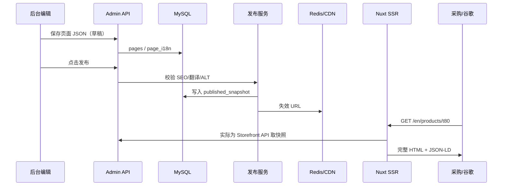

### 10.2 页面 JSON 示例（概念）

后台存的不是 HTML 大字符串（难迁移、易 XSS），而是结构化区块：

```json
{
  "pageType": "home",
  "locale": "en",
  "seo": {
    "title": "Fuel Dispenser Manufacturer | FuelTech",
    "description": "CE-certified fuel dispensers for gas stations and fleets. OEM available.",
    "canonical": "https://www.example.com/en"
  },
  "blocks": [
    { "type": "hero", "props": { "heading": "...", "imageId": "..." } },
    { "type": "trustBar", "props": { "items": ["CE", "ISO 9001"] } },
    { "type": "productGrid", "props": { "source": "featured" } }
  ]
}
```

Nuxt 有一个 `BlockRenderer`：未知类型则忽略并打日志，保证老前台遇到新区块不白屏。

### 10.3 「定制化」的三层，避免每个单都改代码

| 层级 | 谁来做 | 例子 |
| --- | --- | --- |
| L1 配置 | 客户运营 | 改文案、图、排序、显隐区块 |
| L2 模板 | 你的交付顾问 | 换主题色、导航、参数模板、新增落地页 |
| L3 代码 | 研发 | 新区块类型、特殊交互、与客户 ERP 对接 |

报价时写进合同：L1/L2 含在年费，L3 按人天。这样平台才可商用，而不是每个客户变成定制项目部。

### 10.4 预览

- 草稿预览链接带短期 token，`X-Robots-Tag: noindex`。
- 预览域名可与正式域名分离，防止草稿被索引。

---

## 11. 多语言与本地化

### 11.1 推荐策略

中小客户：**一域 + 路径** `/en/` `/es/` `/ar/`  
集团客户：国家独立域或子域，后台仍是同一租户多站点。

URL 规则一旦上线不要摇摆，必须写进《站点约定》：

- 全小写、短横线 slug。
- 语言前缀必有（含默认语言，利于 hreflang 对称；或默认语言无前缀但 **全站一致**）。
- 产品 slug 按语言可不同：`/es/productos/surtidor-t80`。

### 11.2 翻译资产分级

| 级别 | 内容 | 建议 |
| --- | --- | --- |
| 机器可预翻 + 必须人审 | 博客、栏目长文 | 术语表约束 |
| 必须母语或专业译者 | 首页、产品名、证书、法律页 | 出错即毁品牌 |
| 不翻译只切换 | 数字参数、型号 | 单位要本地化（L/min 等） |

### 11.3 RTL

阿拉伯语站点：

- 布局镜像、图标方向、数字与拉丁型号保持 LTR 嵌入。
- 字体：Google Fonts 或自托管 Noto Naskh，注意 CLS。
- 表单标签与错误信息完整翻译。

### 11.4 语言与 SEO

- 每个语言页输出完整 hreflang 列表 + `x-default`。
- 互为翻译的页用 `hreflang`，不要把西语页 canonical 到英语页（那是在放弃西语索引）。
- 未完成翻译的语言：该页 302 到主语言或直接不出现在导航和 sitemap。

---

## 12. SEO 全覆盖清单

本章是独立站的「能做的全部做到」。分为 **平台必须自动完成** 与 **交付/运营必须人工完成**。漏掉后者，再好的代码也没有询盘。

### 12.1 爬虫与索引（技术，平台做）

| 项 | 做法 |
| --- | --- |
| SSR HTML | Nuxt `ssr: true`，核心内容在首包 HTML |
| HTTPS | 全站强制 301 到 https |
| 主机归一 | www 与裸域只留一个 |
| 尾斜杠策略 | 全局统一，另一边 301 |
| robots.txt | 放行前台，禁止 `/api/`、`/admin/`、预览参数 |
| XML Sitemap Index | 按语言拆分 `sitemap-en.xml` … 含 lastmod |
| 图片/视频/新闻 sitemap | 图片 sitemap 第二期；视频若有则加 |
| Canonical | 每页唯一 |
| 分页 | 分类页 `rel=next/prev` 或页 2+ canonical 到自身并优化内容；禁止无限参数索引 |
| 筛选 URL | `?voltage=220` 默认 noindex,follow 或 canonical 回分类 |
| 软 404 | 空分类不要 200 空壳装有内容 |
| 下架 | 301 到分类或替代产品，或 410 |
| 改 slug | 强制填旧地址 301 |
| hreflang | HTML head 输出，可辅 sitemap |
| x-default | 指向全球默认语言页 |
| 多语言重复 | 翻译页互指，不互相 canonical |
| IndexNow | 发布/下架 ping |
| 预览页 | noindex + 密码或 token |
| 日志 | 保留爬虫 5xx，运维周报 |

### 12.2 性能与 Core Web Vitals（技术，平台做）

| 项 | 做法 |
| --- | --- |
| LCP | 首屏图预加载、CDN、合适尺寸、压缩 |
| INP | 少主线程长任务、第三方脚本延迟（GTM 同意后加载） |
| CLS | 图片宽高、字体 font-display、广告位预留 |
| 图片 | WebP/AVIF、srcset、ALT 必填 |
| JS | 路由级拆包，首屏少依赖 |
| CSS | 关键 CSS，避免巨大 UI 库全量进前台 |
| 字体 | 自托管子集，工业站 1～2 个族即可 |
| HTTP | HTTP/2 或 3，Brotli |
| 缓存 | 产品页短缓存 + 发布失效；静态资源长缓存 hash |
| TTFB | Nuxt 与 Java 同机房或边缘缓存 HTML（注意按 cookie 的 Cache-Control） |

### 12.3 On-page（平台给编辑器 + 运营填写）

| 项 | 做法 |
| --- | --- |
| Title | 50～60 字符，主词靠前，每页独一无二 |
| Meta Description | 120～160 字符，含行动号召 |
| H1 唯一 | 产品名或栏目名，不与 Title 完全重复也可，但主题一致 |
| H2/H3 | 参数、应用、OEM、FAQ |
| URL slug | 英文短词 `fuel-dispenser-t80` |
| 首屏 100 词 | 回答「是什么 / 给谁 / 差异」 |
| 内链 | 产品 ↔ 方案 ↔ 博客 ↔ 案例 |
| 锚文本 | 自然含关键词，避免「点击这里」刷屏 |
| 图片 ALT | 描述机型与用途，不堆砌 |
| 外链 | 证书机构、展会，适度 |
| 出站 | `rel=noopener`，合作伙伴 |
| 目录 TOC | 长文生成 |
| 更新日期 | 博客显示，sitemap lastmod 真实 |

**加油机首页 Title 示例：**  
`Fuel Dispenser Manufacturer | CE & ISO | FuelTech`  
**产品页示例：**  
`T80 Fuel Dispenser 4 Nozzle 120L/min | FuelTech`

### 12.4 结构化数据（平台按页类型自动拼，编辑可补）

| 页面 | Schema.org 类型 |
| --- | --- |
| 全站 | Organization、WebSite、WebPage |
| 首页 | 可加 ItemList 精选产品 |
| 产品 | Product、Brand、Offer（价格未知则用 `Offer` + `availability` 询价描述，或不用假价格）、BreadcrumbList |
| FAQ 区块 | FAQPage |
| 文章 | Article、Person（作者） |
| 视频 | VideoObject |
| 面包屑 | BreadcrumbList |
| 联系 | ContactPoint |
| 工厂地址真实时 | Organization.address；勿伪造 LocalBusiness 星级 |

禁止：假 Review、假 AggregateRating。可商用平台不能帮客户造假评分。

Open Graph / Twitter Card：每页 `og:title` `og:description` `og:image`（1200×630）、`og:locale` 及 alternate。

### 12.5 国际 SEO

- Search Console 分属性：域名属性优先。
- 语言/国家意图：西语页写拉美市场用词时，用 `es-MX` 等更细 locale 要谨慎，先做 `es` 再拆。
- 货币与单位：展示 USD/EUR 说明「FOB 询价」，避免误导。
- 服务器与 CDN：国外访问为主时，源站或 CDN 必须在海外节点。

### 12.6 内容 SEO（运营做，平台提供栏目）

工业站靠 **主题聚类（Topic Cluster）**：

- 支柱页：`Fuel Dispenser Buying Guide`
- 集群：流量精度、加油站改造、移动加油、ATEX、OEM、AdBlue 加注
- 每个产品页底部「相关文章」
- 对比页：`80L vs 120L dispenser`（落地页构建器）
- 国家页谨慎：`fuel dispenser manufacturer for UAE` 要有真实出口案例，否则薄内容

更新频率建议：上线后 3 个月每周 1 篇专业文 + 2 条产品或案例更新。

### 12.7 站外与品牌（平台预留，执行靠交付）

- Google Business（若有真实海外办公室或展会地址，禁止假地址）。
- 行业目录：Made-in-China 外的正规名录需人工。
- 展会落地页 + 二维码询盘。
- YouTube 产品视频嵌入（VideoObject）。
- 外链建设不提供自动化群发功能。

### 12.8 转化 SEO（让流量变成询盘）

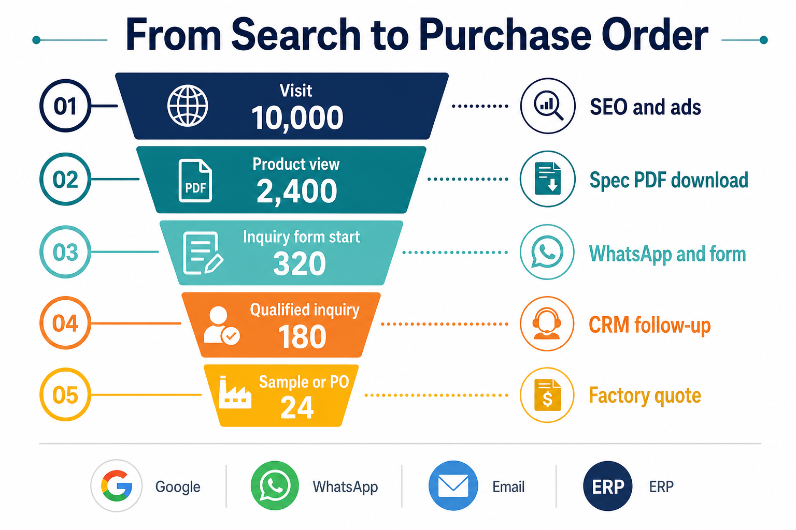

- 每页可见 CTA：Get Quote / WhatsApp。
- 表单字段尽量少，产品页自动带入型号。
- 信任：证书、验厂、付款方式说明（T/T、LC）。
- Thank You 页供广告转化。
- 404 页提供搜索与联系。
- 电话、邮箱纯文本可复制，避免只做图片。

### 12.9 分析与 Search 生态（上线必配）

- GA4 + GSC + Bing Webmaster。
- 事件：`generate_lead`、`file_download`、`whatsapp_click`。
- GTM，默认同意模式（Consent Mode）模板。
- 若投 Google Ads：转换接 Thank You。

### 12.10 安全与 SEO 的交叉

- 黑客注入垃圾外链会毁站：WAF、后台 2FA、文件上传类型限制。
- `sitemap` 不含后台。
- 防参数复制内容被黑帽利用。

### 12.11 上线 SEO 验收（打勾才能交客户）

见附录 A 检查表。核心：抽 10 个 URL 看「查看网页源代码」是否有产品正文；用富结果测试工具测 JSON-LD；手机 PageSpeed 核心指标过关（工业大图站 LCP 目标 &lt; 2.5s，视主机而定，达不到要优化图）。

---

## 13. 询盘、转化与客户跟进

### 13.1 表单字段（加油机默认可配）

必填建议：姓名、公司、邮箱、国家、需求描述。  
选填：WhatsApp、目标型号、数量、电压、证书要求、目标港口、是否 OEM。

另加：

- 蜜罐隐藏字段（机器人会填）。  
- 同意隐私政策勾选（欧盟）。  
- 验证码（Turnstile / reCAPTCHA，同意后再加载）。

### 13.2 通知与 SLA

- 邮件即时发给销售组。  
- 企微/钉钉一条。  
- 后台未读红点。  
- 承诺客户：工作日 2 小时内人工回复（写进你的代运营合同）。

### 13.3 与阿里国际站的关系

独立站询盘质量和品牌溢价通常更高，但量可能先小于平台。话术：

**独立站承接品牌搜索与复购，阿里承接大盘；后台询盘最终都进同一 CRM。**

第一期可导出 Excel；第二期 Webhook 进企业微信或 HubSpot。

---

## 14. 核心数据模型

下列为逻辑模型，实现时每张业务表含：`id, tenant_id, created_at, updated_at, deleted_at`。

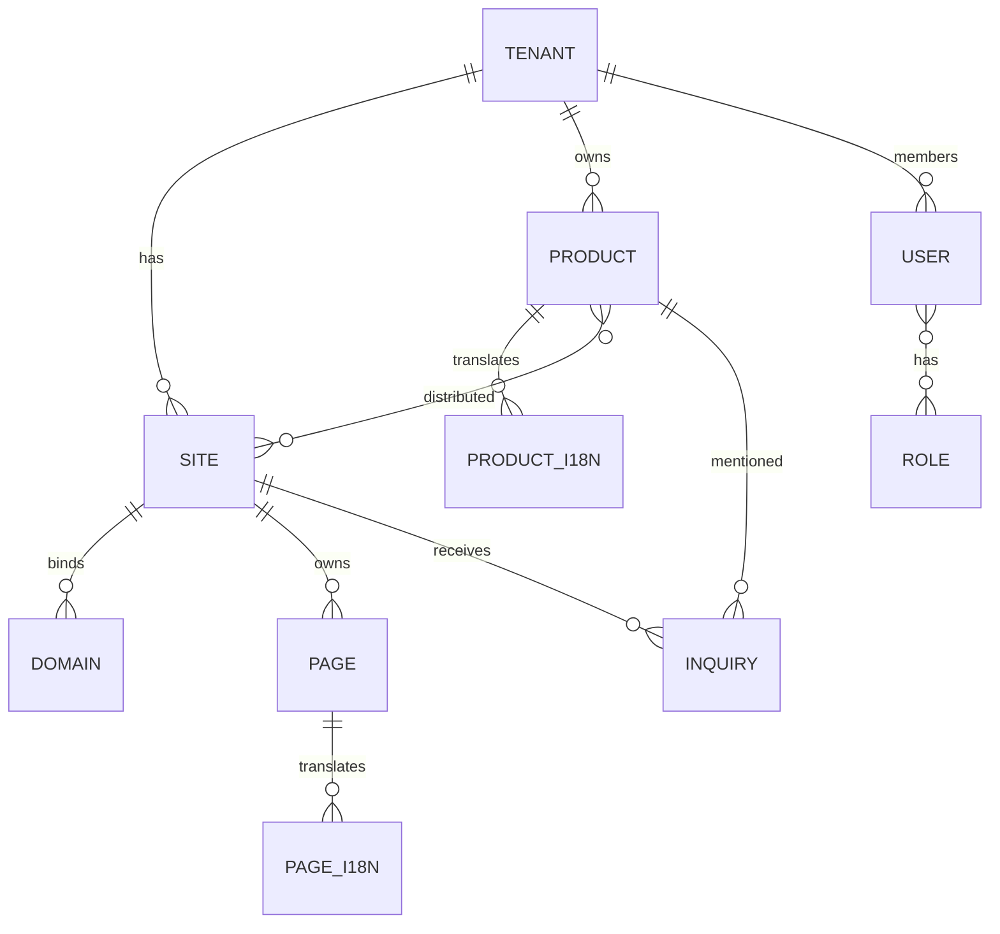

**关键表：**

- `tenant` `package` `tenant_quota`
- `site` `domain` `theme_token`
- `locale` `i18n_entry` `glossary`
- `user` `role` `permission` `user_site_scope`
- `asset` `asset_variant`
- `page` `page_i18n` `page_version` `block_definition`
- `article` `article_i18n` `article_category`
- `category` `category_i18n`
- `product` `product_i18n` `sku` `product_attr` `attr_template`
- `product_site`（分发、排序、覆盖 SEO）
- `inquiry` `inquiry_field` `inquiry_event`
- `redirect` `seo_template` `sitemap_job`
- `audit_log` `publish_release`

商品与站点是多对多：同一台 T80 可出现在英文主站与西班牙分站，西语站可覆盖描述和是否显示价格。

---

## 15. 技术栈、仓库结构与接口约定

### 15.1 技术栈汇总

| 端 | 技术 | 说明 |
| --- | --- | --- |
| 后台 | Vue 3、Vite、TypeScript、Pinia、Vue Router、Element Plus（或 Naive UI） | 企业后台效率优先 |
| 独立站 | Vue 3、Nuxt 3、TypeScript、Nuxt I18n、Nuxt Image | SEO + 体验 |
| 后端 | Java 17、Spring Boot 3、Spring Security、MyBatis-Plus | 可商用、易招人 |
| 数据库 | MySQL 8 | utf8mb4 |
| 缓存 | Redis 7 | |
| 存储 | MinIO / OSS / R2 | |
| 反向代理 | Nginx 或 Caddy | |
| 容器 | Docker Compose 第一期，K8s 可后期 | |
| CI | GitHub Actions / Gitea Actions | |

后台 **不要** 把 Element Plus 打进 Nuxt 前台，避免 CSS/JS 污染 Core Web Vitals。

### 15.2 建议的仓库（Monorepo）

确认代码阶段将按此生成：

```
独立站/
  README.md
  docs/                          # 本文与后续接口文档
  infra/                         # docker-compose、nginx、env 示例
  apps/
    admin/                       # Vue3 SaaS 后台
    storefront/                  # Nuxt3 独立站
  services/
    tradehub-api/                # Java Spring Boot
  packages/
    shared-types/                # 可选：OpenAPI 生成的 TS 类型
```

### 15.3 环境变量原则

- 密钥只放环境变量与密钥管理，不进 Git。
- 分 `dev` / `staging` / `prod`。
- 站点域名在库里配，不写死在代码。

### 15.4 API 约定

- JSON、camelCase。
- 统一 `{ code, message, data }`。
- 时间 ISO-8601 UTC，前台按 locale 格式化。
- 分页 `{ list, total, page, pageSize }`。
- 错误码分段：401 登录、403 权限、404 资源、409 冲突、422 校验、429 限流。
- Admin 写操作乐观锁 `version`，防两人同时改一页。

---

## 16. 权限、安全与合规

### 16.1 角色模型（租户内）

| 角色 | 典型权限 |
| --- | --- |
| 租户所有者 | 全部、账单、成员 |
| 站点管理员 | 某几个站的配置与发布 |
| 内容编辑 | 页面、博客、媒体，无域名无成员 |
| SEO 专员 | SEO 中心、重定向、sitemap，有限发布 |
| 商品管理员 | 商品上下架 |
| 销售 | 询盘读写、无改价 |
| 只读访客 | 给客户老板看报表 |

平台超管与租户数据访问要二次确认（模拟登录需审计）。

### 16.2 安全清单

- 密码哈希（BCrypt/Argon2）、登录限流、可选 2FA。
- 上传：MIME 白名单、杀毒或至少禁可执行文件、图片再编码。
- XSS：富文本白名单（如仅允许安全标签）；自定义 HTML 仅超管。
- CSRF：Cookie 方案时 SameSite + Token；纯 JWT Header 则注意 XSS 盗 Token。
- SQL：MyBatis 参数化，禁止拼接 `tenant_id`。
- SSRF：媒体抓 URL 要禁内网。
- 询盘限流与验证码。
- 依赖漏洞扫描（OWASP 依赖检查）。
- 后台必须独立子域 `admin.yoursaas.com`，并限制国家或 IP（可选）。

### 16.3 合规

| 法规/实践 | 做什么 |
| --- | --- |
| GDPR / 英国 UK GDPR | 隐私政策、同意记录、询盘数据保留期、导出/删除入口（可第二期完整 DSR） |
| Cookie | 分类同意：必要 / 统计 / 营销 |
| CAN-SPAM / 营销邮件 | 默认询盘回复是事务邮件；营销订阅另开口 |
| 出口与制裁 | 系统不自动筛名单，但合同提示客户自行合规；可后期加国家禁运提示 |
| 中文站备案 | 若服务器在中国且面向国内，按法规备案；外贸站建议海外主机 |
| 无障碍 | 对比度、键盘焦点、表单 label（有助于 SEO 与专业形象） |

---

## 17. 上线、部署与运维

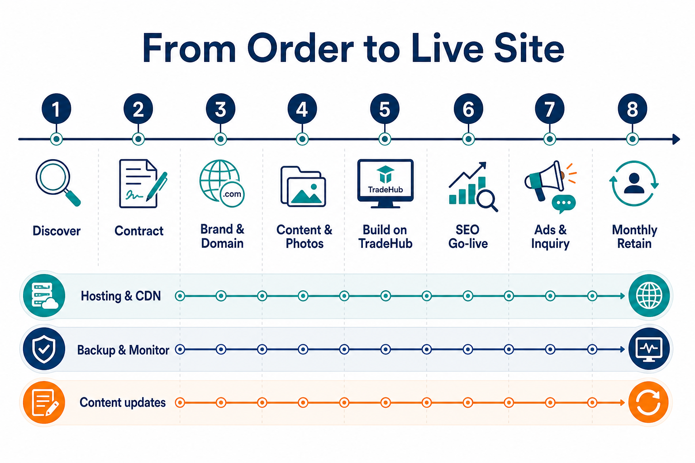

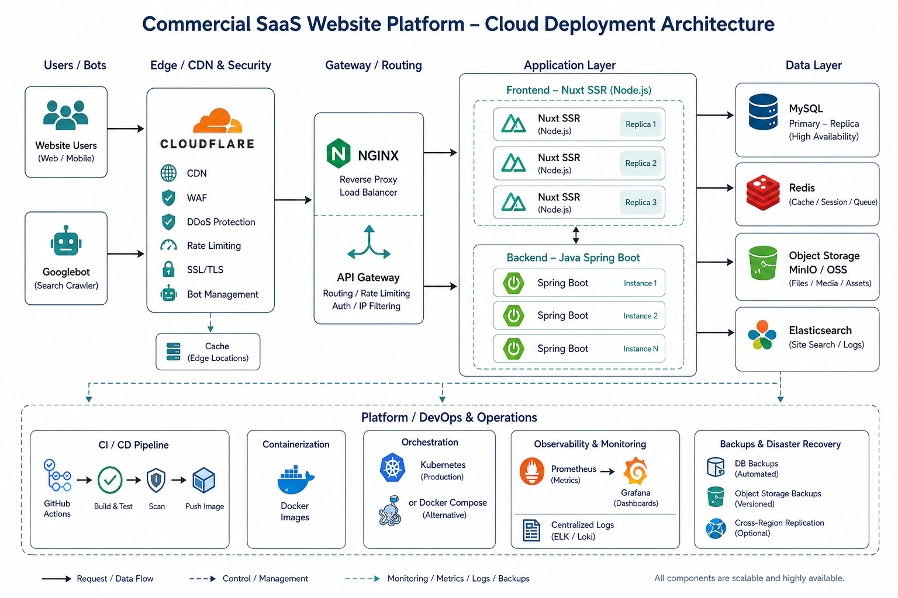

### 17.1 推荐生产拓扑（外贸）

- **DNS + CDN + WAF**：Cloudflare（海外访问友好）。
- **源站**：海外 VPS 或云（新加坡 / 美东 / 法兰克福，按客户市场）。
- **Java + Nuxt + MySQL + Redis**：Docker Compose 即可起步。
- **对象存储**：R2 或 S3 兼容，公网走 CDN。
- **邮件**：SendGrid / Amazon SES / 企业邮箱 SMTP，SPF、DKIM、DMARC 配好，否则询盘通知进垃圾箱。

国内备案主机适合国内营销站，不适合主攻谷歌的外贸站（延迟与屏蔽风险）。可商用默认 **海外源站**。

### 17.2 发布流程

1. `develop` 自动部署到 staging（测试租户 + 加油机样例数据）。
2. 产品/SEO 在 staging 点验收清单。
3. 打 tag 发生产，数据库迁移 Flyway/Liquibase。
4. 健康检查失败自动回滚镜像。

### 17.3 监控与备份

| 项 | 第一期最低标准 |
| --- | --- |
| 可用性 | Uptime 探测首页与 `/api/store/health` |
| 日志 | 集中文件 + 错误告警（邮件/企微） |
| APM | 可第二期（SkyWalking） |
| 备份 | MySQL 每日全量 + binlog，OSS 跨区域，保留 30 天 |
| 恢复演练 | 每季度一次 |
| 证书 | Let’s Encrypt 自动续期告警 |
| 容量 | 磁盘、inode、Redis 内存告警 |

### 17.4 运维手册要写的日常

- 客户要加域名：Cloudflare 指到源、后台绑域、等 SSL。
- 客户改了产品型号：改 slug 走 301。
- 流量突增：CDN 缓存、扩 Nuxt 副本、询盘限流防打满。
- 被黑：切维护、重置密码、查上传目录、提交 GSC 安全问题。

### 17.5 性能容量粗算（便于报价服务器）

| 规模 | 配置起点 |
| --- | --- |
| 1～5 个站，日 PV &lt; 2 万 | 2C4G × 2（应用+库可先合） |
| 20 个站，日 PV 10 万级 | 应用与库分离，Nuxt 2 副本，MySQL 4C8G |
| 站群 50+ 或活动爆量 | HTML 边缘缓存、读写分离、搜索独立 |

---

## 18. 客户必须提供的内容与素材清单

没有这些，平台再强也是空壳。接单时作为 **《客户物料表》** 发给工厂，收齐 70% 再排期上线。

### 18.1 品牌与法律

- 中英文公司法定名称、品牌名、Slogan。
- Logo（SVG + PNG 透明，深色/浅色）。
- 品牌色（主色、辅色、按钮色）。
- 营业执照、英文简介、成立年份、人数、厂房面积（可约）。
- 厂房地址、展厅地址；海外分公司则另提供。
- 联系人、邮箱、电话、WhatsApp、社交链接。
- 隐私政策所需：数据控制者名称与邮箱。

### 18.2 证书与信任

- CE、ISO 9001、ATEX、计量许可等扫描件（高清）。
- 专利、检测报告封面。
- 验厂照片、产线、检测台、仓库、装柜。
- 禁止：PS 过度、假证书。你方有权拒绝上传。

### 18.3 产品

- 产品列表 Excel：型号、分类、核心参数、卖点中英文。
- 每款至少 5 张图：白底、细节、接口、应用现场、包装。
- 视频（MP4 或 YouTube）。
- PDF 样本册、接线/外形图（可隐去机密尺寸）。
- 常见配件清单。
- 哪些型号可 OEM、MOQ、交期（可不公开价格）。

### 18.4 市场与内容

- 主攻国家 / 语言。
- 目标关键词（可你方调研后确认）。
- 成功案例：国家、项目类型、是否可公开客户名。
- 3～5 个采购常问问题。
- 博客：可先由你方根据产品写，工厂工程师审核。

### 18.5 数字资产

- 域名是否已买、谁管理 DNS。
- 企业邮箱是否可发信。
- 是否已有 GA / Ads / 像素。
- 竞品网址 3 个（便于对标信息架构）。

### 18.6 你方要准备的「平台侧」资产

- 加油机英文样例站一整套演示数据（便于销售演示）。
- 摄影师/三维规范：图片比例 4:3、最小边 1600px。
- 术语表（中英西阿）。
- 法律页英文模板（律师审核后复用）。

---

## 19. 接单交付 SOP（从签约到月度运维）

按此执行，平台才能变成 **可复制的生意** 而不是作坊。

### 阶段 0 · 销售（3～7 天）

1. 演示 TradeHub 样例加油机站 + 后台切站。
2. 填《需求卡》：语言、站点数、是否博客、是否对接 ERP。
3. 报价：建设费 + 年订阅 + 可选代运营。
4. 合同：含物料提交期限、修改轮次（如 2 轮）、不含违法站群。

### 阶段 1 · 开工（第 1 周）

1. 开通租户、打安装油机模板。
2. 收 Logo、色板、域名。
3. 建项目群，指定客户产品接口人。

### 阶段 2 · 信息架构与关键词（第 1～2 周）

1. 出栏目树与产品分类。
2. 出关键词表（主词、产品词、方案词）。
3. 客户签字确认 IA（信息架构），之后改栏目算变更。

### 阶段 3 · 内容与视觉（第 2～4 周）

1. 导入产品、修图、填参数。
2. 搭首页与 5 个核心产品页。
3. 翻译与审校。
4. 证书、工厂、联系页。

### 阶段 4 · SEO 技术上线（第 4～5 周）

1. 绑域、SSL、301、GA4、GSC、Bing。
2. staging 跑附录 A。
3. 去掉全站 noindex，提交 sitemap。
4. 培训：后台改产品、回询盘、看草稿。

### 阶段 5 · 增长（上线后 90 天）

1. 每周内容 + 内链。
2. 根据 GSC 补缺失页（例如某个流量词没有落地页）。
3. 可选：Google Ads 品牌词保护 + 精准产品词。

### 阶段 6 · 月度运维

- 可用性、备份检查。
- 询盘垃圾清理。
- 证书过期、域名续费提醒。
- 核心词排名快照（可手工 Search Console）。
- 安全更新。

---

## 20. 收费、人员与成本建议

以下为 **国内外贸建站服务商常见量级**，供你定价参考，不是报价单。请按你的城市与英文能力调整。

### 20.1 对外报价结构（建议）

| 项目 | 内容 | 计费思路 |
| --- | --- | --- |
| 平台订阅 | 租户 + 1 个站 + 2 语言 + 20GB 媒体 | 年付，体现 SaaS |
| 建设实施 | 模板落地、导入、培训 | 一次性 |
| 加语言 / 加站 | 配额内或加购 | 年增 |
| 代运营 | 内容 4 篇/月 + SEO + 询盘清洗 | 月费 |
| 定制区块 / ERP | L3 开发 | 人天 |

### 20.2 你方内部角色（小团队可兼职）

| 角色 | 职责 |
| --- | --- |
| 产品/交付经理 | SOP、验收、客户沟通 |
| 前端 | Vue 后台 + Nuxt 模板 |
| Java | 中台 |
| SEO 顾问 | 关键词、内容大纲、GSC |
| 英语编辑 | 审校，机械英语 |
| 设计师 | 仅主题 Token 与首页气质（模板化后很少出原画） |
| 运维 | 兼职即可起步 |

### 20.3 成本提醒

- 翻译和摄影往往比写代码贵，合同里要单列或由客户自备。
- 海外服务器、Cloudflare、企业邮箱、Turnstile 都是月成本，计入订阅。
- 不要承诺「上线必到首页」；承诺「技术 SEO 满分 + 内容基建 + 培训」。

---

## 21. 分期实施路线图

### 第一期 MVP（建议 6～8 周开发，可售标准版）

**后台：** 登录、租户/站点、角色、页面构建器（核心 12 个区块）、商品 CRUD 与上下架、媒体、询盘、中英（架构支持多语言）、SEO 基础（Title/Desc/canonical/sitemap/robots/301）、发布预览。

**Java：** 模块化单体、Admin + Storefront API、租户隔离、文件上传、邮件通知。

**Nuxt：** 加油机主题、第 9.3 节全部关键页、SSR、hreflang、JSON-LD、询盘、响应式。

**交付物：** 演示租户 + 文档 + Docker 本地一键起。

### 第二期（可售专业版）

- 翻译工作台、术语表、RTL、AI 预翻。
- 内容分发到多站点、定时发布、版本对比。
- IndexNow、图片 sitemap、更完整分析事件。
- 表单构建器、询盘分配、Webhook。
- 搜索优化、相关推荐。
- 2FA、操作日志完善、配额套餐。

### 第三期（规模化接单 / 白标）

- 模板市场、代理商开户。
- 边缘 HTML 缓存、多区域部署。
- ERP/CRM 对接、询盘自动国家风险提示。
- A/B 测试、个性化 CTA。
- Elasticsearch、多语言分词。
- 客户自助开通站点（需支付与风控）。

### 明确不做（防范围蔓延）

- 第一期不做完整购物车、多币种结算、复杂促销。
- 不做自动外链平台、采集站群。
- 不做原生 App（询盘后台用响应式即可）。

---

## 22. 验收标准与风险

### 22.1 产品验收（你自己签）

- 用租户 A 登录看不到租户 B 任何 API 数据（抽测改 `tenant_id` 应 403）。
- 发布前草稿外网 noindex。
- 加油机样例 20 个 URL 源代码可见正文。
- 新建西班牙语页后 sitemap 与 hreflang 自动变。
- 下架产品前台 404/410/301 符合设置，后台仍能查历史询盘。
- 连续提交询盘触发限流。
- 备份恢复能在空库还原并打开首页。

### 22.2 风险登记

| 风险 | 影响 | 对策 |
| --- | --- | --- |
| 客户不给资料 | 工期无限 | 合同：物料延迟则上线顺延，预付不退工时 |
| 纯 CSR 旧习惯 | SEO 失败 | 架构锁定 Nuxt SSR |
| 翻译质量差 | 询盘少、品牌损 | 术语表 + 人审才能发布 |
| 假证书假好评 | 法律与信任 | 平台拒绝、合同退出条款 |
| 微服务过度设计 | 运维崩 | 一期单体 |
| 谷歌算法 | 排名波动 | 不作弊、内容 E-E-A-T、技术健康 |
| 单机宕机 | SLA 违约 | 监控、快照、Cloudflare 缓存兜底静态 |
| 需求每个客户不同 | 无法产品化 | 三层定制（10.3）+ 区块迭代进产品库 |

---

## 23. 确认后如何生成代码

请你确认或批注本文后，再进入编码。建议按 **垂直切片** 生成，每片都能跑通：

1. **骨架**：Monorepo、Docker Compose（MySQL/Redis/MinIO）、Java 空项目、Vue3 Admin 登录壳、Nuxt3 空站。
2. **租户 + 站点 + 域名解析**。
3. **商品 + 分类 + 上下架 + Storefront 产品页 SSR**。
4. **页面构建器 + 首页渲染**。
5. **询盘 + 邮件**。
6. **i18n + hreflang + sitemap + JSON-LD**。
7. **加油机演示数据一键种子脚本**。
8. **SEO 与权限打磨、操作手册**。

你可以直接回复例如：

- 「按第一期 MVP 开始生成代码」  
- 或「后台 UI 用 Element Plus / Naive UI」  
- 或「先只要文档微调：必须支持阿拉伯语 RTL」等。

未确认前 **不写业务代码**，避免方向返工。

---

## 24. 附录

### 附录 A · 上线 SEO / 质量检查表

**抓取**

- [ ] https 强制  
- [ ] www 归一  
- [ ] robots 正确  
- [ ] sitemap 提交且无 404  
- [ ] 重要页 SSR 源代码有 H1 与 200 字以上正文  
- [ ] 预览与后台 noindex  

**页面**

- [ ] Title / Description 无重复  
- [ ] 每页一个 H1  
- [ ] 图 ALT  
- [ ] 内链到询盘  
- [ ] 404 定制  

**国际**

- [ ] hreflang 往返一致  
- [ ] 语言切换不丢当前页映射  

**结构数据**

- [ ] 富结果测试无致命错误  
- [ ] 无假评论  

**性能**

- [ ] 移动端可交互  
- [ ] 大图压缩  

**转化**

- [ ] 询盘可收到邮件  
- [ ] GA4 出 `generate_lead`  
- [ ] GSC 属性验证  

**法律**

- [ ] Privacy / Cookie  
- [ ] 表单同意  

### 附录 B · 加油机站推荐关键词方向（需再做真实搜量工具确认）

- 主词：fuel dispenser, petrol pump machine, fuel pump dispenser  
- 商业词：fuel dispenser manufacturer, fuel dispenser factory China, OEM fuel dispenser  
- 场景：gas station fuel dispenser, mobile fuel dispenser, skid mounted fuel dispenser  
- 技术：high accuracy fuel dispenser, 4 nozzle fuel dispenser, ATEX fuel dispenser  
- 信息：how to choose a fuel dispenser, fuel dispenser maintenance  

### 附录 C · 与 WordPress 方案的差异（客户常问）

| | WordPress + 建站主题 | TradeHub |
| --- | --- | --- |
| 多客户 | 一套 WP 一个站，运维线性恶化 | 一个后台 N 站 |
| SEO | 插件堆叠，质量参差 | 引擎级 SSR + 结构化数据 |
| 工业参数 | 靠自定义字段杂乱 | 参数模板 + 分发 |
| 接单复制 | 每次搬家 | 模板一键开通 |
| 安全 | 插件漏洞常见 | 自控依赖面 |
| 代价 | 起步快 | 需要先做中台（本文的目的） |

### 附录 D · 插图索引

| 文件 | 内容 |
| --- | --- |
| `docs/images/01-architecture-overview.png` | 总体架构 |
| `docs/images/02-saas-admin-dashboard.png` | SaaS 后台示意 |
| `docs/images/03-storefront-homepage.png` | 加油机独立站首页 |
| `docs/images/04-content-distribution.png` | 内容分发 |
| `docs/images/05-seo-fullstack.png` | SEO 全覆盖 |
| `docs/images/06-page-builder.png` | 页面搭建器 |
| `docs/images/07-i18n-workflow.png` | 多语言流程 |
| `docs/images/08-golive-ops.png` | 交付与运维时间线 |
| `docs/images/09-inquiry-funnel.png` | 询盘漏斗 |
| `docs/images/10-product-lifecycle.png` | 商品上下架生命周期 |
| `docs/images/11-deployment-architecture.png` | 部署架构 |
| `docs/images/12-multi-tenant.png` | 多租户隔离 |

### 附录 E · 文档修订

| 版本 | 日期 | 说明 |
| --- | --- | --- |
| v1.0 | 2026-08-24 | 首版建设规划，待确认后编码 |

---

**文档结束。** 你现在拥有的是一份可拿去对内对齐、对外讲方案、对开发当需求基线的规划书。确认范围后，再在本目录生成可运行的 Vue3 后台、Java 后端与 Nuxt3 加油机独立站模板。
